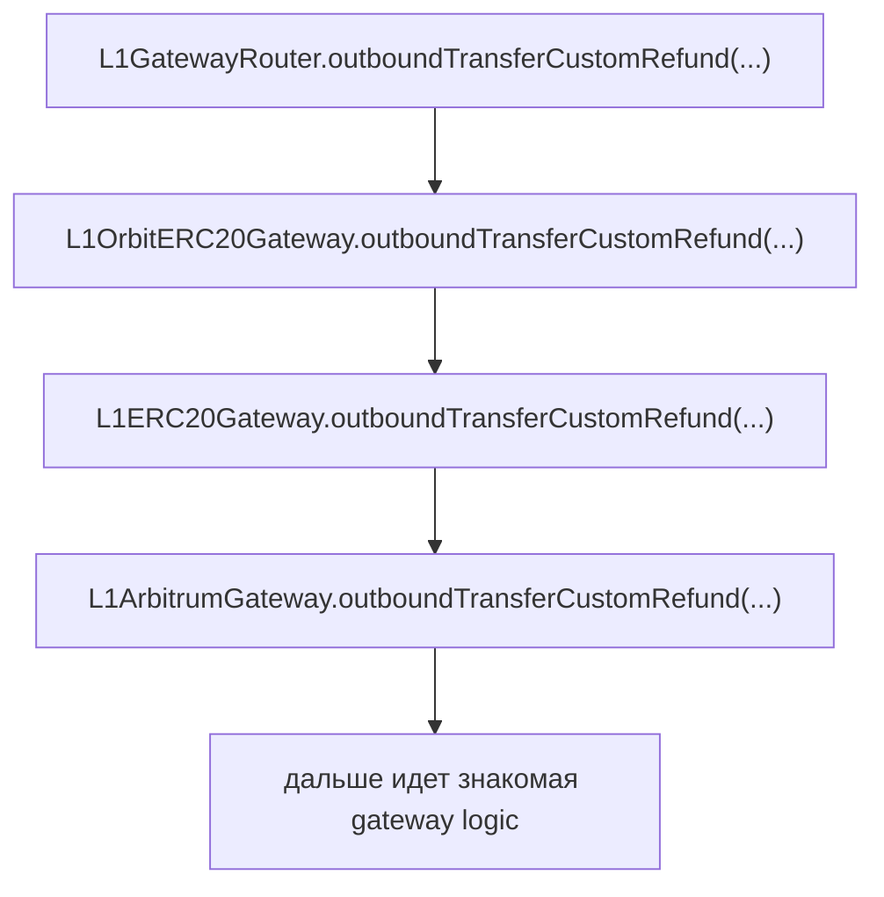

# Orbit L3 ERC20 Review

## Overview

Этот репозиторий содержит короткий review `Orbit` `L3` parent-to-child `ERC20` bridge path.

Главная идея здесь не в том, чтобы подавать `Orbit` как полностью отдельную full bridge-систему.

Главная идея в том, чтобы выделить `Orbit`-specific часть `ERC20` flow и показать, где именно она расходится со знакомой унаследованной bridge-моделью.

## Reviewed Orbit-Specific Functions

- `L1GatewayRouter.outboundTransferCustomRefund(...)`
- `L1OrbitERC20Gateway.outboundTransferCustomRefund(...)`
- `L1ERC20Gateway.outboundTransferCustomRefund(...)`

## Flow

## Review Shape

Главное отличие здесь сосредоточено в wrapper-layer.

После этих wrapper-функций path продолжает знакомую gateway logic, как и в стандартном `L1 -> L2` `ERC20` bridge flow.

## Files

- [`diff-review.md`](./diff-review.md) — `Orbit`-specific wrapper и точка, где path возвращается в знакомую gateway logic
- [`trail-of-bits-findings.md`](./trail-of-bits-findings.md) — relevant `Trail of Bits` findings, привязанные к этому bridge path
